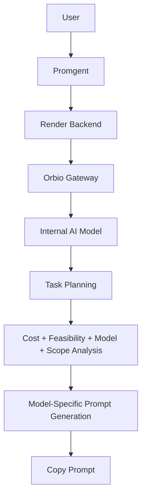

# PROMGENT

**Know what your AI budget can accomplish before you spend it.**

Describe what you want to build, choose a target model, a quality preference and a CREDIT budget.
Promgent tells you how much work that really is, whether your model can handle it, whether your
budget supports it, and what to cut if it doesn't — then gives you the prompt to run yourself.

Promgent never executes your task. It plans it, prices it, and hands you the prompt.

---

**Live Demo:** https://promgent.vercel.app
**GitHub:** https://github.com/Nasxx05/inference-manager
**Demo Video:** _(add link)_

---

## How Promgent works



Promgent uses an internal AI model through the Orbio Gateway to reason about the user's task and
compile a model-specific prompt. The user does not connect a wallet, provide an Orbio key, or
execute the task through Promgent. Promgent plans the work and returns a prompt the user can take
elsewhere.

| Layer | Where | Notes |
|---|---|---|
| Frontend | Vercel | Static UI. Holds no credentials. |
| Backend | Render | Owns the Orbio API key. Does all AI calls. |
| Orbio Gateway | `AGENTFUND_AI_BASE_URL` | OpenAI-compatible API used by the backend. |
| Internal AI model | `AGENTFUND_AI_MODEL` | Configurable through server environment variables. |
| Final task execution | **Outside Promgent** | The user runs the copied prompt themselves. |
| User CREDIT field | Planning budget | A number the user types — **not a wallet balance**. |

---

## What it does

Promgent is a budget-aware AI task planner and prompt compiler. For a single request it answers:

1. **What exactly are you trying to do?** — classified, and probed with targeted questions.
2. **How much work is that?** — an effort model with requirement counts, not a vague label.
3. **Can your model handle it?** — model suitability, judged from capability metadata.
4. **How much inference is likely required?** — a CREDIT range, a floor and a recommended ceiling.
5. **Does your budget support it?** — feasible, tight, feasible with reduced scope, or insufficient.
6. **If not, what should change?** — an iteratively optimized scope, re-estimated.
7. **What's the most appropriate execution strategy?** — phases, iteration plan, revision policy.
8. **What prompt should you use?** — a structured, budget-aware prompt built for your target model.

The output is a prompt. You copy it and run it wherever you like.

---

## Why it exists

AI work is easy to start and hard to scope. "Build me a RAG agent" and "write a product
description" look like the same kind of request in a chat box, but they differ by an order of
magnitude in real work. Most tools will happily tell you a task costs "7 CREDIT" because they
classify it as one "high complexity" item and map that label to a number.

Promgent refuses to do that. It counts requirements, weights phases, models iteration and repair,
and multiplies by the actual price of the model you chose. A portfolio site stays cheap; a
production RAG pipeline and a multi-tenant SaaS platform cost substantially more — because the
underlying work does.

---

## Clarification actually changes the plan

Promgent resolves the task and the user's answers into one **enriched task
specification** before analysis: `originalTask` (verbatim), resolved
requirements (each with a workload weight), answers, and stated assumptions.

Because the estimator reads that same specification, answers affect **effort,
requirement count, cost, model suitability and scope** — not only the wording of
the prompt. Confirming authentication, multi-user support or production
deployment raises the estimate; "no auth" or "prototype only" lowers it.

Questions are only asked when the answer could materially change the work, and
skipped questions become explicit assumptions rather than silent defaults.

---

## How the planning engine works

The pipeline is deliberately split: **one LLM call** does the understanding, and **everything
numeric is computed locally**.

```text
Original task (never compressed into a summary)
        │
        ├── Local classification → clarifying questions
        │
        ├── ONE internal LLM call → task analysis + generated prompt
        │
        └── Local, deterministic:
              task effort → per-phase tokens → iteration passes
              → repair reserve → context/tool overhead
              → model pricing → CREDIT range
              → minimum viable → feasibility → scope optimization
              → model suitability
```

**Why the split matters.** An LLM is not a calculator. It estimates *work* — effort, requirements,
per-phase token needs, iteration ranges. Promgent turns those into CREDIT using the configured
model's pricing. That keeps every number reproducible, auditable, and impossible for the model to
invent.

### The effort model

Cost comes from measured characteristics, never from a complexity→CREDIT lookup table:

| Signal | What it captures |
|---|---|
| `requirementCount` | Distinct units of work. "Auth, database, API, payments" is many, not one. |
| `implementationSize` | How much artifact is actually produced. |
| `contextOverhead` | Reading, research, document and codebase context. |
| `toolOverhead` | Integrations, dependencies, environment work. |
| `revisionLoad` | Expected debugging, integration failures and tuning. |
| `estimatedIterations` | The real loop: plan → generate → test → debug → revise. |

Iterations, repair, context and tool overhead are explicit line items, not a single flat
multiplier. Testing and revision are never free.

### Estimate output

Every result carries:

```text
Minimum viable:  15 CREDIT     ← below this, the scope is unlikely to complete
Estimated:       18–28 CREDIT  ← a planning range, never a precise promise
Recommended max: 30 CREDIT     ← includes the safety margin
Reserve:         4 CREDIT      ← held back for revision
Confidence:      Medium        ← Low for vague or huge tasks
```

Ranges widen as confidence falls. Nothing is displayed with false precision.

### Budget status

| Status | Meaning |
|---|---|
| `FEASIBLE` | Budget covers the recommended maximum. |
| `TIGHT` | The lower end fits, but there is little room for surprise. |
| `FEASIBLE_WITH_OPTIMIZATION` | Fits after an optimized, re-estimated scope. |
| `INSUFFICIENT` | Below the minimum viable floor; scope cuts won't save it. |

### Scope optimization

The optimizer works iteratively, not by deleting half the optional features:

```text
Original → estimate → over budget? → defer highest-cost, lowest-essentiality work
        → re-estimate → repeat → stop when the budget is met or nothing more can go
```

An expensive feature that is essential is kept. An expensive feature that is optional is the first
to go.

### Model suitability

Two independent verdicts, never collapsed into one score:

- **Model suitability** — does the model have the capability? Compared on shared 0–100 scales
  (coding, reasoning, research, context, structured output) against what the task demands.
- **Budget feasibility** — can you afford it?

A weak model on a complex task produces *"not recommended"* (never *"cannot do it"*), with a
suggested switch and its cost delta. You can keep your model; the override is recorded and the
added revision risk is stated. No model is named in the engine, so renaming or adding models
changes nothing.

---

## How Orbio powers the internal agent

Promgent's internal task-analysis and prompt-compilation agent runs through the **Orbio Gateway**,
using the builder's Orbio API key configured **server-side on Render**.

**The user does not need to connect an Orbio account.** There is no wallet, no API-key field, and
no seed phrase anywhere in the product. The Orbio key powers Promgent's own internal AI processing
only.

```text
Promgent (Vercel)
        ↓
Render Backend
        ↓
Orbio Gateway
        ↓
Configured Model
        ↓
Task Intelligence
```

### Configuration

Set on Render (never in the browser, never logged, never returned by any endpoint):

```env
AGENTFUND_AI_API_KEY=
AGENTFUND_AI_BASE_URL=https://api.orbio.so/api/v1
AGENTFUND_AI_MODEL=
```

The provider layer is **model-agnostic**. The base URL, key and model all come from the
environment; no model is hard-coded. Orbio's gateway is OpenAI-compatible and relays to the named
model, so switching `AGENTFUND_AI_MODEL` is enough to change the internal model — no code change,
and no model-specific business logic anywhere in the planner.

> The `AGENTFUND_AI_*` prefix is kept for deployed-environment compatibility. It is configuration,
> not branding.

---

## Powered by Orbio

Promgent's internal task-planning agent runs through the **Orbio inference
gateway**. Promgent uses Orbio's model access to analyze tasks and compile
prompts, while keeping execution under the user's control.

**Promgent plans. The user executes.** No wallet is connected, and Promgent never
runs the final prompt.

---

## Architecture

| Layer | Where | Responsibility |
|---|---|---|
| Frontend | Vercel (Next.js) | UI only. Holds no credentials. |
| Backend | Render (Express) | Owns the LLM credentials; does the slow work. |
| Internal provider | Orbio Gateway | Task analysis + prompt generation. |

The browser calls the backend directly, because writing a prompt takes long enough that a
serverless function would time out first.

### LLM budget

| Step | Calls |
|---|---|
| `/api/clarify` | **0** — local classification only |
| `/api/plan` | **1** combined call (analysis + prompt); two only if the model can't do both together |
| Cost, feasibility, scope, suitability | **0** — all local |

---

## Technical implementation

```
lib/
  estimator/
    taskEffort.ts          effort model, requirement counting, iteration ranges
    tokenEstimator.ts      per-phase input/output tokens
    iterationEstimator.ts  plan → generate → test → debug → revise
    costEstimator.ts       workload → CREDIT via model pricing
    feasibilityEngine.ts   feasible / tight / optimized / insufficient
  models/
    capabilities.ts        model + task profiles on shared 0–100 scales
    suitability.ts         three-way suitability verdict + suggestions
    modelSelector.ts       cheapest *viable* model for the task and budget
  scopeOptimizer/          iterative, re-estimated scope reduction
  clarifier/               question selection + answer → workload signal
  ai/                      provider-agnostic LLM adapter (Orbio behind it)
  validation/              schema validation and clamping of model output
data/models.ts             single model registry (replaceable with live data)
```

Key invariants:

- **The original task is preserved end to end.** The estimator receives the user's own wording,
  never the LLM's one-sentence summary — a summary discards exactly the detail that separates a
  small task from a large one.
- **Clarifying answers move the estimate**, not just the prompt. Confirming authentication,
  multi-user support or production deployment adds real components.
- **Model output is never trusted.** Every response is validated and clamped; omitted fields fall
  back to local derivation.
- **No secrets reach the browser.** The key is server-side, unlogged, and absent from every
  response.

### Abuse protection

The internal model is paid for by the builder's key, so the backend is bounded:

- IP rate limit: 8 plan requests/minute, 40/hour (configurable)
- Clarify rate limit: 60/minute
- Concurrency ceiling: 6 simultaneous planning requests
- Request body limit: 1 MB; task length: 8,000 characters
- Per-call timeout via `AGENTFUND_AI_TIMEOUT_MS`; bounded retries (max 2 attempts)
- `ALLOWED_ORIGINS` enforced — no localhost fallback in production

---

## Testing

```bash
npm test
```

193 tests across 13 files. Rather than testing internals, most assert the product promise:

| Area | What's asserted |
|---|---|
| Effort scaling | Portfolio is low/medium; RAG is high; SaaS is very-high/extreme |
| Estimate ordering | Each task costs strictly more than the last, and a simple task stays cheap |
| No collapse | A RAG build never receives a single-digit estimate |
| Weak model | Complex task + weak model → not recommended, with a suggestion |
| Strong model | Same task → suitable |
| Budget | 5/10/20/30 CREDIT produce different, monotone verdicts |
| Answers | Confirming auth/multi-user/production raises the estimate |
| Original wording | Full task costs more than its compressed summary |
| Scope optimizer | Iteratively converges toward the budget without ever increasing it |
| Malformed output | Empty, absurd and NaN-bearing responses never crash or produce NaN |
| Model switching | `AGENTFUND_AI_MODEL` changes require no code change |

---

## Deployment

**Frontend (Vercel)**
```env
NEXT_PUBLIC_BACKEND_URL=https://your-backend.onrender.com
```

**Backend (Render)**
```env
AGENTFUND_AI_API_KEY=
AGENTFUND_AI_BASE_URL=https://api.orbio.so/api/v1
AGENTFUND_AI_MODEL=
AGENTFUND_AI_MAX_TOKENS=4500
AGENTFUND_AI_TIMEOUT_MS=90000
ALLOWED_ORIGINS=https://promgent.vercel.app
```

Health endpoints: `/health`, `/health/ai`, `/health/ai/test`. None return secrets.

To change the internal model, set `AGENTFUND_AI_MODEL` and restart. Nothing else is required.

---

## What Promgent is and is not claiming

Accuracy matters more than confidence, so the limits are stated plainly:

- **An internal AI model is required.** Task analysis and prompt generation go
  through the configured model. Without `AGENTFUND_AI_*` set, planning fails —
  there is no offline mode that produces real plans.
- **Model and pricing data is curated static MVP data.** It is a small set of
  model *family* profiles, not a live catalogue and not a complete list of any
  provider's models. Capability scores are Promgent's internal suitability
  heuristics, **not** benchmark rankings.
- **Estimates are planning estimates.** They are computed locally from workload
  signals and curated pricing. They are not live Orbio prices and not a
  guaranteed provider bill.
- **Model suitability is heuristic.** "Not recommended" means the model is
  unlikely to be a reliable choice for this task — not that it cannot attempt it.
- **Confidence reflects information, not statistics.** It measures how much
  structured information the estimate was built from, not a confidence interval
  from past runs.

## Notes and limits

- Model pricing and capability scores are **static configuration, not live data**, and capability
  scores are heuristics rather than benchmarks. The registry is structured so both can be replaced
  with live provider data.
- The **Planning Budget** is a number the user enters. It is not an Orbio balance and is
  not read from any wallet or billing system. CREDIT is Orbio's tokenized inference
  unit; Promgent uses it as the planning primitive for estimates, not as a payment rail.
- Estimates are planning ranges. Actual external cost depends on the model, token usage,
  iterations, tools and execution environment.
- No wallet, no Orbio account connection, no prompt execution, no agent marketplace.