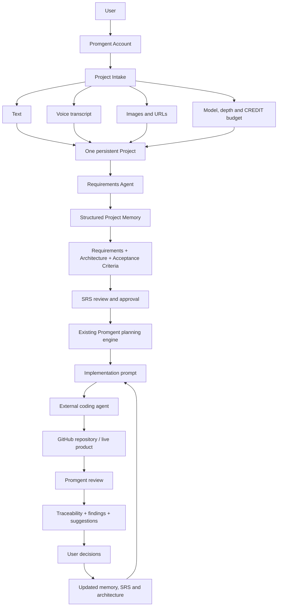
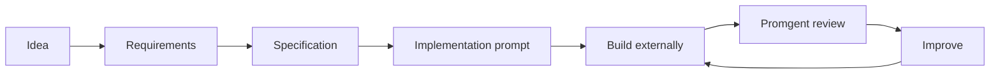
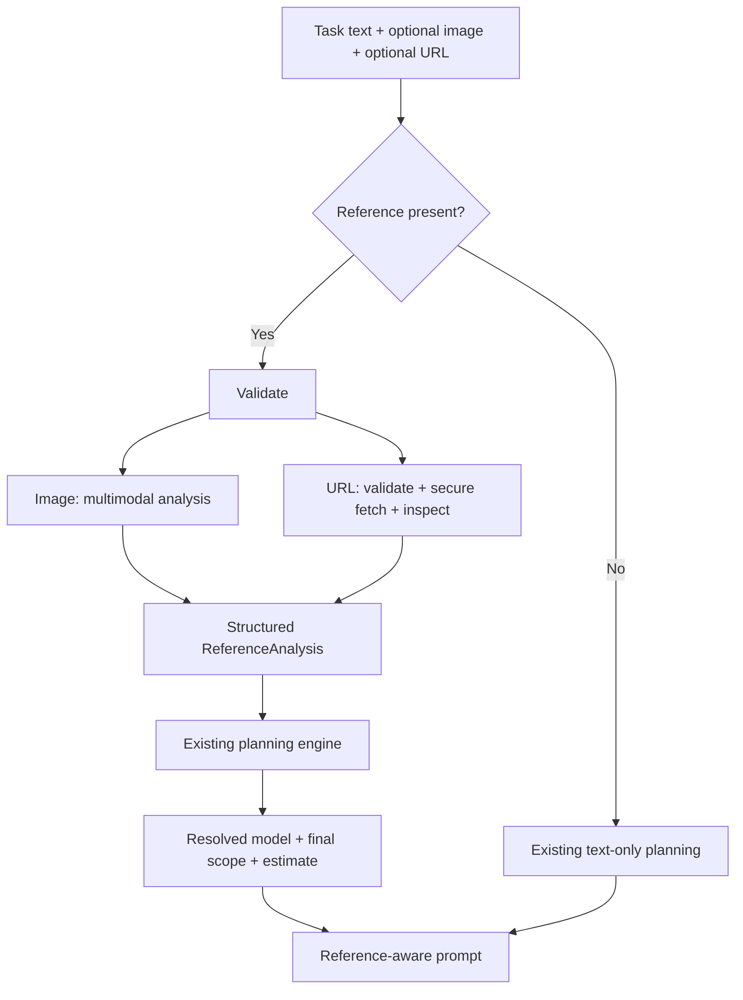
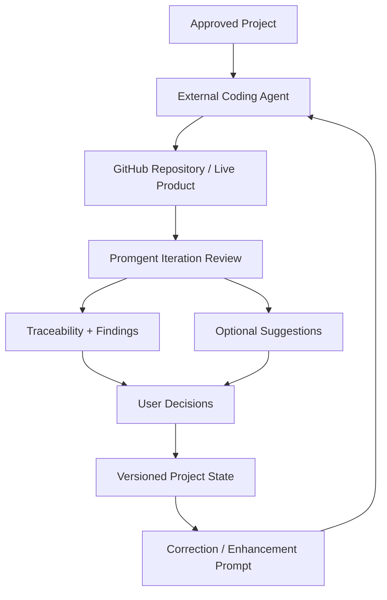

# Promgent

Promgent is an AI software-engineering agent that guides a project from idea and requirements
through implementation review and iterative improvement. It turns an idea into structured
requirements, architecture, an SRS and an implementation handoff, then compares the externally
built product against the agreed specification.

Promgent does not execute the user's application. The user builds with an external coding agent
and returns the repository or live product to Promgent for review.

---

**Live Demo:** https://promgent.vercel.app
**GitHub:** https://github.com/Nasxx05/inference-manager
**Demo Video:** https://www.youtube.com/watch?v=lX3L2aQozeA

---

## Unified project lifecycle


```mermaid
flowchart TD
    A[User] --> B[Promgent Account]
    B --> C[Project Intake]
    C --> C1[Text]
    C --> C2[Voice transcript]
    C --> C3[Images and URLs]
    C --> C4[Model, depth and CREDIT budget]
    C1 --> D[One persistent Project]
    C2 --> D
    C3 --> D
    C4 --> D
    D --> E[Requirements Agent]
    E --> F[Structured Project Memory]
    F --> G[Requirements + Architecture + Acceptance Criteria]
    G --> H[SRS review and approval]
    H --> I[Existing Promgent planning engine]
    I --> J[Implementation prompt]
    J --> K[External coding agent]
    K --> L[GitHub repository / live product]
    L --> M[Promgent review]
    M --> N[Traceability + findings + suggestions]
    N --> O[User decisions]
    O --> P[Updated memory, SRS and architecture]
    P --> J
```

There is one primary **New Project** flow. The former task planner is an internal subsystem used
after SRS approval; it is not a second product or a separate project history.

| Layer | Where | Notes |
|---|---|---|
| Frontend | Vercel | Static UI. Holds no credentials. |
| Backend | Render | Authenticates users, owns project persistence and makes user-key-funded Orbio calls. |
| Orbio Gateway | `ORBIO_BASE_URL` | OpenAI-compatible inference API connected by the user. |
| Project model | `Project.selectedModel` | Remains authoritative for requirements, planning, prompt generation and review. |
| Final task execution | **Outside Promgent** | The user runs the copied prompt themselves. |
| Project CREDIT budget | Project setting | One budget and usage ledger across the lifecycle; it is not a wallet balance. |

### The user flow


```mermaid
flowchart LR
    A[Idea] --> B[Requirements]
    B --> C[Specification]
    C --> D[Implementation prompt]
    D --> E[Build externally]
    E --> F[Promgent review]
    F --> G[Improve]
    G --> E
```

---

## Multimodal References

Promgent can now accept optional visual and website references alongside the user's task. Users can
paste a website URL directly into the task input, or attach an image using the input's `+` control.

Promgent processes those references **before** planning the task. Images are analyzed for visual
structure and design characteristics. Website references are inspected for relevant visual and
structural patterns. The resulting reference analysis is combined with the user's original task and
passed through Promgent's existing model, budget, scope and prompt-planning pipeline.

References are optional. Text-only requests continue to use the existing planning flow with no
reference processing at all.

### How a reference flows through the system


```mermaid
flowchart TD
    A[Task text + optional image + optional URL] --> B{Reference present?}
    B -- No --> Z[Existing text-only planning]
    B -- Yes --> C[Validate]
    C --> D[Image: multimodal analysis]
    C --> E[URL: validate + secure fetch + inspect]
    D --> F[Structured ReferenceAnalysis]
    E --> F
    F --> G[Existing planning engine]
    G --> H[Resolved model + final scope + estimate]
    H --> I[Reference-aware prompt]
    Z --> I
```

Key rules the implementation follows:

- **The original task stays authoritative.** A reference answers "what should this look like?",
  never "what does the user want?". Both are carried through to the prompt.
- **One resolved model, one final scope.** References do not create a second model-selection or
  scope system; they are additional input to the existing pipeline.
- **References do not bypass budget or feasibility.** The scope optimizer still runs when the
  budget is too small.
- **Uncertainty is recorded, not invented.** Anything the analyzer cannot determine confidently is
  listed in `uncertainties` rather than guessed.

---

## What it does

Promgent is a budget-aware AI task planner and prompt compiler. For a single request it answers:

1. **What exactly are you trying to do?** — classified, and probed with targeted questions.
2. **How much work is that?** — an effort model with requirement counts, not a vague label.
3. **Can your model handle it?** — model suitability, judged from capability metadata.
4. **How much inference is likely required?** — a CREDIT range, a floor and a recommended ceiling.
5. **Does your budget support it?** — feasible, tight, feasible with reduced scope, or insufficient.
6. **If not, what should change?** — an iteratively optimized scope, re-estimated.
7. **What's the most appropriate execution strategy?** — phases, iteration plan, revision policy.
8. **Do you have a reference?** — an optional image or website URL, understood before planning.
9. **What prompt should you use?** — a structured, budget-aware prompt built for your target model.

The output is a prompt. You copy it and run it wherever you like.

---

## Why it exists

AI work is easy to start and hard to scope. "Build me a RAG agent" and "write a product
description" look like the same kind of request in a chat box, but they differ by an order of
magnitude in real work. Most tools will happily tell you a task costs "7 CREDIT" because they
classify it as one "high complexity" item and map that label to a number.

Promgent refuses to do that. It counts requirements, weights phases, models iteration and repair,
and multiplies by the actual price of the model you chose. A portfolio site stays cheap; a
production RAG pipeline and a multi-tenant SaaS platform cost substantially more — because the
underlying work does.

---

## Clarification actually changes the plan

Promgent resolves the task and the user's answers into one **enriched task
specification** before analysis: `originalTask` (verbatim), resolved
requirements (each with a workload weight), answers, and stated assumptions.

Because the estimator reads that same specification, answers affect **effort,
requirement count, cost, model suitability and scope** — not only the wording of
the prompt. Confirming authentication, multi-user support or production
deployment raises the estimate; "no auth" or "prototype only" lowers it.

Questions are only asked when the answer could materially change the work, and
skipped questions become explicit assumptions rather than silent defaults.

---

## How the planning engine works

The pipeline is deliberately split: **one LLM call** does the understanding, and **everything
numeric is computed locally**.

```text
Original task (never compressed into a summary)
        │
        ├── Local classification → clarifying questions
        │
        ├── ONE internal LLM call → task analysis + generated prompt
        │
        └── Local, deterministic:
              task effort → per-phase tokens → iteration passes
              → repair reserve → context/tool overhead
              → model pricing → CREDIT range
              → minimum viable → feasibility → scope optimization
              → model suitability
```

**Why the split matters.** An LLM is not a calculator. It estimates *work* — effort, requirements,
per-phase token needs, iteration ranges. Promgent turns those into CREDIT using the configured
model's pricing. That keeps every number reproducible, auditable, and impossible for the model to
invent.

### The effort model

Cost comes from measured characteristics, never from a complexity→CREDIT lookup table:

| Signal | What it captures |
|---|---|
| `requirementCount` | Distinct units of work. "Auth, database, API, payments" is many, not one. |
| `implementationSize` | How much artifact is actually produced. |
| `contextOverhead` | Reading, research, document and codebase context. |
| `toolOverhead` | Integrations, dependencies, environment work. |
| `revisionLoad` | Expected debugging, integration failures and tuning. |
| `estimatedIterations` | The real loop: plan → generate → test → debug → revise. |

Iterations, repair, context and tool overhead are explicit line items, not a single flat
multiplier. Testing and revision are never free.

### Estimate output

Every result carries:

```text
Minimum viable:  15 CREDIT     ← below this, the scope is unlikely to complete
Estimated:       18–28 CREDIT  ← a planning range, never a precise promise
Recommended max: 30 CREDIT     ← includes the safety margin
Reserve:         4 CREDIT      ← held back for revision
Confidence:      Medium        ← Low for vague or huge tasks
```

Ranges widen as confidence falls. Nothing is displayed with false precision.

### Budget status

| Status | Meaning |
|---|---|
| `FEASIBLE` | Budget covers the recommended maximum. |
| `TIGHT` | The lower end fits, but there is little room for surprise. |
| `FEASIBLE_WITH_OPTIMIZATION` | Fits after an optimized, re-estimated scope. |
| `INSUFFICIENT` | Below the minimum viable floor; scope cuts won't save it. |

### Scope optimization

The optimizer works iteratively, not by deleting half the optional features:

```text
Original → estimate → over budget? → defer highest-cost, lowest-essentiality work
        → re-estimate → repeat → stop when the budget is met or nothing more can go
```

An expensive feature that is essential is kept. An expensive feature that is optional is the first
to go.

### Model suitability

Two independent verdicts, never collapsed into one score:

- **Model suitability** — does the model have the capability? Compared on shared 0–100 scales
  (coding, reasoning, research, context, structured output) against what the task demands.
- **Budget feasibility** — can you afford it?

A weak model on a complex task produces *"not recommended"* (never *"cannot do it"*), with a
suggested switch and its cost delta. You can keep your model; the override is recorded and the
added revision risk is stated. No model is named in the engine, so renaming or adding models
changes nothing.

---

## Reference processing

Reference handling lives in `src/lib/reference/`, isolated so the planner stays responsible for
planning orchestration only.

| Module | Responsibility |
|---|---|
| `types.ts` | `ReferenceInput`, `ReferenceAnalysis`, limits |
| `urlSafety.ts` | URL detection and SSRF validation |
| `imageValidation.ts` | Magic-byte image validation |
| `websiteInspector.ts` | Secure single-page fetch and inspection |
| `referenceAnalyzer.ts` | Structured analysis + prompt translation |
| `workload.ts` | How much planning work a reference adds |
| `index.ts` | Orchestration seam used by the backend |

### Images

PNG, JPEG and WEBP are accepted, up to 5MB each, at most 4 references per request. The backend
validates the **actual bytes** against magic-byte signatures — a client-supplied MIME type is only
a claim — and rejects a declared type that disagrees with the file. Images are held in memory for
the request and never written to disk, so there is no image storage to operate or leak.

Image understanding uses the project's selected Orbio model. When that model does not support
image input, Promgent fails clearly rather than switching models or claiming to have understood an
image it cannot see. The legacy standalone planner may still use `AGENTFUND_AI_MULTIMODAL_MODEL`.

### Website URLs

A URL typed into the task field is detected automatically; the text is never rewritten. Before any
fetch, the URL is validated and every redirect target is re-checked:

- only `http` / `https`
- `localhost`, loopback, private, link-local and cloud-metadata addresses rejected
- credentials in the URL rejected
- bounded redirects, bounded timeout, bounded response size
- one page only — no crawling

Failures return structured errors (`BLOCKED_REFERENCE_URL`, `WEBSITE_FETCH_TIMEOUT`,
`WEBSITE_UNAVAILABLE`, …) and never become a fake successful analysis.

### What website inspection does today

The inspector fetches the single page and extracts real structure: title, meta description,
headings, navigation labels, landmark sections, detected components, stack hints and a small text
sample for topic.

It does **not** render the page, so it does **not** claim to know colour, typography or spacing.
Those fields are left absent and the limitation is recorded in `uncertainties`. The architecture
supports adding a renderer later without changing the planner.

### From reference to prompt

The reference is translated into actionable instructions rather than pointed at, because the final
prompt may be copied to a model that never sees the original image or URL:

> BAD: "Make the website like the reference image."
>
> BETTER: "Use the supplied visual reference as the design direction. Reproduce the overall layout
> hierarchy, oversized hero typography, restrained colour system, generous whitespace, card
> composition and navigation treatment while creating an original implementation and content."

The prompt is instructed to produce an **original** implementation inspired by the reference, not
to copy proprietary copy, logos or assets.

## How Orbio powers a project

Orbio provides the inference infrastructure. The user connects one Orbio key to their account and
selects a model available through that connection. Promgent uses that connection for the same
project's requirements, SRS, planning, prompt generation and review calls unless the user changes
the project model explicitly. Provider-reported usage is written to the project usage ledger; the
provider remains authoritative for the actual charge.

```text
Promgent (Vercel)
        ↓
Render Backend
        ↓
Orbio Gateway
        ↓
Configured Model
        ↓
Task Intelligence
```

### Configuration

Set on Render (never in the browser, never logged, never returned by any endpoint):

```env
ORBIO_BASE_URL=https://api.orbio.so/api/v1
SUPABASE_URL=
SUPABASE_ANON_KEY=
SUPABASE_SERVICE_ROLE_KEY=
CREDENTIAL_ENCRYPTION_KEY=

# Separate voice transcription configuration (never inherited from chat)
TRANSCRIPTION_URL=https://api.orbio.so/api/v1/audio/transcriptions
TRANSCRIPTION_API_KEY=
TRANSCRIPTION_MODEL=openai/whisper-large-v3-turbo
TRANSCRIPTION_REQUEST_MODE=json_base64
TRANSCRIPTION_TIMEOUT_MS=60000

# Cache only safe Orbio connection metadata for two minutes
ORBIO_STATUS_CACHE_MS=120000
```

`CREDENTIAL_ENCRYPTION_KEY` must be one stable 32-byte value encoded as 64 hexadecimal
characters. Configure the same value on every Render instance and deployment; changing it makes
previously stored Orbio credentials unreadable.

The user connects an Orbio key after signing in and selects a model for each project.
`Project.selectedModel` remains authoritative for requirements extraction, acceptance criteria,
planning, semantic repository review, suggestions, suggestion discussions, change impact and
iteration prompts. The encrypted key is decrypted only for a user-funded backend request.
`AGENTFUND_AI_*`/legacy `AI_*` variables remain only for the legacy planner endpoints and the
separate voice-transcription infrastructure; they do not override a persistent project's model.

---

## Powered by Orbio

Promgent's project intelligence runs through the **Orbio inference gateway** using the signed-in
user's encrypted connection and the model selected on that project.

**Promgent plans. The user executes.** Promgent never runs the final implementation prompt.

### Getting CREDIT

CREDIT remains the project's planning budget and usage-ledger unit. The dashboard also reads the
connected Orbio key's provider balance server-side and displays it separately; Promgent never
returns the raw key or handles top-up payments.

---

## Architecture

| Layer | Where | Responsibility |
|---|---|---|
| Frontend | Vercel (Next.js) | UI only. Holds no credentials. |
| Backend | Render (Express) | Auth, persistence orchestration, validation and user-key-funded inference. |
| Project provider | Orbio Gateway | Runs `Project.selectedModel` for the canonical project lifecycle. |

The browser calls the backend directly, because writing a prompt takes long enough that a
serverless function would time out first.

### Latency operations

The backend emits safe `[perf]` stage timings for project creation, interview turns, and
repository review. Provider logs contain the selected model and provider duration, but never API
keys, prompts, personal content, ciphertext, or authorization headers. Run the controlled local
round-trip benchmark with `cd server && npm run benchmark:perf`; treat its result as an
orchestration comparison, and use deployed `[perf]` logs for real before/after latency.

`GET /health` exposes only safe cold-start diagnostics (`startedAt`, `uptimeSeconds`, and a short
deployment commit). A sleeping Render instance can still add platform cold-start latency; Promgent
does not create fake keep-alive traffic.

Record the active Render and Supabase regions in the deployment runbook. Keep the backend near the
database when the hosting plans permit it; this repository does not migrate infrastructure
automatically.

### LLM budget

| Step | Calls |
|---|---|
| `/api/clarify` | **0** — local classification only |
| `/api/plan` | **1** combined call (analysis + prompt); two only if the model can't do both together |
| Cost, feasibility, scope, suitability | **0** — all local |

---

## Technical implementation

```
lib/
  estimator/
    taskEffort.ts          effort model, requirement counting, iteration ranges
    tokenEstimator.ts      per-phase input/output tokens
    iterationEstimator.ts  plan → generate → test → debug → revise
    costEstimator.ts       workload → CREDIT via model pricing
    feasibilityEngine.ts   feasible / tight / optimized / insufficient
  models/
    capabilities.ts        model + task profiles on shared 0–100 scales
    suitability.ts         three-way suitability verdict + suggestions
    modelSelector.ts       cheapest *viable* model for the task and budget
  scopeOptimizer/          iterative, re-estimated scope reduction
  clarifier/               question selection + answer → workload signal
  ai/                      provider-agnostic LLM adapter (Orbio behind it)
  validation/              schema validation and clamping of model output
data/models.ts             single model registry (replaceable with live data)
```

Key invariants:

- **The original task is preserved end to end.** The estimator receives the user's own wording,
  never the LLM's one-sentence summary — a summary discards exactly the detail that separates a
  small task from a large one.
- **Clarifying answers move the estimate**, not just the prompt. Confirming authentication,
  multi-user support or production deployment adds real components.
- **Model output is never trusted.** Every response is validated and clamped; omitted fields fall
  back to local derivation.
- **No secrets reach the browser.** The key is server-side, unlogged, and absent from every
  response.

### Abuse protection

Project inference is paid for through the user's connected Orbio key, so the backend is bounded:

- IP rate limit: 8 plan requests/minute, 40/hour (configurable)
- Clarify rate limit: 60/minute
- Concurrency ceiling: 6 simultaneous planning requests
- Request body limit: 1 MB; task length: 8,000 characters
- Per-call timeout via `AGENTFUND_AI_TIMEOUT_MS`; bounded retries (max 2 attempts)
- `ALLOWED_ORIGINS` enforced — no localhost fallback in production

---

## Testing

```bash
npm test
```

323 tests across 26 files. Rather than testing internals, most assert the product promise:

| Area | What's asserted |
|---|---|
| Effort scaling | Portfolio is low/medium; RAG is high; SaaS is very-high/extreme |
| Estimate ordering | Each task costs strictly more than the last, and a simple task stays cheap |
| No collapse | A RAG build never receives a single-digit estimate |
| Weak model | Complex task + weak model → not recommended, with a suggestion |
| Strong model | Same task → suitable |
| Budget | 5/10/20/30 CREDIT produce different, monotone verdicts |
| Answers | Confirming auth/multi-user/production raises the estimate |
| Original wording | Full task costs more than its compressed summary |
| Scope optimizer | Iteratively converges toward the budget without ever increasing it |
| Malformed output | Empty, absurd and NaN-bearing responses never crash or produce NaN |
| Model continuity | The selected project model is used throughout project reasoning |
| Orbio account | Balance/account links open safely and no credential reaches the browser |
| How to Use dialog | Embeds the walkthrough; closes on Escape; restores focus and scrolling |
| Dialog isolation | Opening and closing never clears input and never submits |

---

## Deployment

**Frontend (Vercel)**
```env
NEXT_PUBLIC_BACKEND_URL=https://your-backend.onrender.com
```

**Backend (Render)**
```env
ORBIO_BASE_URL=https://api.orbio.so/api/v1
SUPABASE_URL=
SUPABASE_ANON_KEY=
SUPABASE_SERVICE_ROLE_KEY=
CREDENTIAL_ENCRYPTION_KEY=
AGENTFUND_AI_MAX_TOKENS=4500
AGENTFUND_AI_TIMEOUT_MS=90000
ALLOWED_ORIGINS=https://promgent.vercel.app
```

Health endpoints: `/health`, `/health/ai`, `/health/ai/test`. None return secrets.

The user changes a persistent project's selected model through the project flow. Environment model
variables do not silently reroute project reasoning.

---

## What Promgent is and is not claiming

Accuracy matters more than confidence, so the limits are stated plainly:

- **A connected Orbio key and concrete project model are required.** Project reasoning fails
  clearly rather than silently falling back to a hidden model.
- **Model and pricing data is curated static MVP data.** It is a small set of
  model *family* profiles, not a live catalogue and not a complete list of any
  provider's models. Capability scores are Promgent's internal suitability
  heuristics, **not** benchmark rankings.
- **Estimates are planning estimates.** They are computed locally from workload
  signals and curated pricing. They are not live Orbio prices and not a
  guaranteed provider bill.
- **Model suitability is heuristic.** "Not recommended" means the model is
  unlikely to be a reliable choice for this task — not that it cannot attempt it.
- **Confidence reflects information, not statistics.** It measures how much
  structured information the estimate was built from, not a confidence interval
  from past runs.

## Reference limitations

These are current, not aspirational:

- **Website pages are not rendered.** Visual style (colour, typography, spacing) is not assessed
  for URL references; only structure and metadata are.
- **Pages that block automated access may not be analyzable.** Bot protection, CAPTCHAs and
  authenticated pages will fail with a structured error.
- **Image analysis depends on the selected project model supporting image input.** Promgent does
  not silently switch to another model when vision is unavailable.
- **Visual interpretation is an AI analysis and may contain uncertainty.** It is recorded, not
  hidden, but it is not ground truth.
- **Promgent does not guarantee pixel-perfect reproduction.** The output is planning guidance.
- **References do not mean copyrighted assets or content are copied.** The prompt is instructed
  toward an original implementation.
- **Video references are not supported.** The architecture is kept extensible, but video is not
  implemented.

## Notes and limits

## Project workspace and API

The persistent project workspace is the primary application. An authenticated
user creates one project, connects one Orbio account, and carries the same
project through intake, requirements, SRS approval, planning, implementation
handoff and review. The browser is not the source of truth; Supabase-backed
project records are.

The project endpoints are:

- `/api/auth/*` for account sessions
- `/api/projects` for persistent project creation and listing
- `/api/projects/:id/interview` for structured interview turns
- `/api/projects/:id/architecture` for Mermaid architecture versions
- `/api/projects/:id/srs` for draft SRS generation
- `/api/projects/:id/plan` for the existing planner's implementation handoff
- `/api/projects/:id/iterations` for persistent implementation-review cycles
- `/api/projects/:id/iterations/:iterationId/review` for repository/live-product evidence review
- iteration decision endpoints for findings, changes and suggestions
- `/api/projects/:id/iterations/:iterationId/generate-prompt` for the next implementation prompt

Apply [`server/migrations/001_guided_projects.sql`](server/migrations/001_guided_projects.sql),
[`server/migrations/002_project_iterations.sql`](server/migrations/002_project_iterations.sql),
[`server/migrations/003_unified_project_lifecycle.sql`](server/migrations/003_unified_project_lifecycle.sql)
and [`server/migrations/004_intelligence_completeness.sql`](server/migrations/004_intelligence_completeness.sql)
to a Supabase project and configure the Supabase and credential-encryption
variables from [`.env.example`](.env.example) before using
the project flow locally. The raw Orbio key is verified server-side,
encrypted before persistence, and never returned to the browser or included in
model context.

The interview opening and every subsequent interview turn make one
OpenAI-compatible Orbio call authenticated with the connected user's Orbio key.
The key is decrypted only in the backend process, never sent to the browser or
included in project memory. Provider-reported input/output tokens are written
to the existing `usage_events` ledger; the provider remains authoritative for
the actual charge. Interview retries are disabled to avoid accidentally billing
an ambiguous request twice.

The implementation-review loop keeps the same `projectId`, canonical Project
Memory, requirements, SRS, architecture, authentication, Orbio connection and
usage ledger. Public GitHub repositories are inspected at an exact commit with
bounded file retrieval and secret redaction. Live URLs reuse the existing SSRF-
protected website inspector. Repository and website content is untrusted data,
not Promgent instructions.

The current review layer supports repository/live URL input, text and voice
transcript feedback, requirements traceability, evidence-backed required fixes,
technical concerns, optional suggestions, user decisions, versioned
SRS/architecture updates for accepted changes, and a user-key-funded next
implementation prompt. Promgent does not execute repository code; source review
is not runtime verification.


```mermaid
flowchart TD
    A[Approved Project] --> B[External Coding Agent]
    B --> C[GitHub Repository / Live Product]
    C --> D[Promgent Iteration Review]
    D --> E[Traceability + Findings]
    D --> F[Optional Suggestions]
    E --> G[User Decisions]
    F --> G
    G --> H[Versioned Project State]
    H --> I[Correction / Enhancement Prompt]
    I --> B
```

Known limits remain: private GitHub OAuth/App access, background review workers, external
implementation usage snapshots, and runtime execution testing are not yet implemented. Uploaded
screenshots are analyzed only when the selected project model supports image input; source review
still does not prove runtime behavior.

- Model pricing and capability scores are **static configuration, not live data**, and capability
  scores are heuristics rather than benchmarks. The registry is structured so both can be replaced
  with live provider data.
- The **Planning Budget** is a number the user enters. It is distinct from the provider-reported
  Orbio balance shown on the account dashboard.
- Estimates are planning ranges. Actual external cost depends on the model, token usage,
  iterations, tools and execution environment.
- Persistent project inference uses the connected user's Orbio key, with
  retries disabled for user-funded calls to avoid ambiguous duplicate charges.
  Promgent still does not execute implementation prompts or operate an agent
  marketplace.
