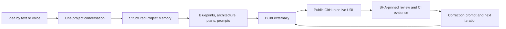

# Promgent

Promgent is an Orbio-powered software-building guide for beginners. One continuous conversation helps a user shape an idea, understand technical choices, create build-ready artifacts, review an implementation, and decide what to do next.

Promgent does not execute implementation prompts. Users build with their preferred coding agent, then bring a public GitHub repository or live URL back for evidence-based review.

- Live product: https://promgent.vercel.app
- Repository: https://github.com/Nasxx05/inference-manager

## Product model

The conversation is the primary experience, but it is not the database. Promgent maintains structured, versioned Project Memory behind the chat:

- original goal and users;
- confirmed, proposed, deferred, and rejected scope;
- requirements and acceptance criteria;
- technical decisions, stack, architecture, data, integrations, and constraints;
- implementation and repository state;
- current project phase and recommended next action;
- artifact versions, actual Promgent usage, and implementation estimates.

Normal technical questions do not silently change project scope. Model output is validated before any state change, and a complete turn is persisted atomically with its two messages, memory version, requirements, decisions, artifacts, model route, and repository/test evidence.

## Main flow


```mermaid
flowchart LR
  A[Idea by text or voice] --> B[One project conversation]
  B --> C[Structured Project Memory]
  C --> D[Blueprints, architecture, plans, prompts]
  D --> E[Build externally]
  E --> F[Public GitHub or live URL]
  F --> G[SHA-pinned review and CI evidence]
  G --> H[Correction prompt and next iteration]
  H --> E
```

There is one Promgent—not separate user-facing interview, requirements, planning, and review agents. Internal specialist modules remain implementation details.

## Orbio and model routing

Users connect their own Orbio API key. The key is encrypted server-side, never returned to the browser after connection, never placed in model context, and never logged.

New projects use Auto mode by default. Promgent caches Orbio's model catalogue and selects the lowest-cost model that meets the task's modality, context, and capability needs. A locked model is honored strictly. Ambiguous provider failures are not automatically retried with a second model because doing so could double-bill the user.

Safe route metadata is persisted: task class, chosen model, reason code, expected cost class, provider usage, and whether fallback occurred. Credentials are never part of route logs.

## Artifacts

Artifacts are versioned project records attached inline to conversation messages:

- Project Blueprint
- architecture
- implementation and test plans
- implementation, correction, and enhancement prompts
- SRS and requirement snapshots
- data/API/deployment plans
- repository reviews
- deterministic implementation CREDIT estimates

Unchanged content reuses its existing artifact version. A changed artifact supersedes the prior current version without deleting history.

## CREDIT terminology

Promgent keeps three concepts separate:

- **Orbio balance** — the user's provider balance.
- **Promgent usage** — actual recorded inference usage for this project.
- **Estimated build budget** — a deterministic estimate for work performed later by an external coding agent.

The implementation estimate uses requirement count, implementation size, context/tool overhead, expected iterations, and revision reserve. The language model supplies workload signals; local code calculates the number.

## Repository review and testing

Public GitHub review is bounded. Promgent records repository, default branch, exact commit SHA, and review time; ranks changed and requirement-relevant files; limits file count and bytes; and treats all repository content as untrusted data.

Review claims distinguish source evidence, live observation, CI evidence, executed-test evidence, inference, and inability to verify. Source inspection alone is never described as runtime proof.

Promgent currently:

- performs bounded static review;
- inspects GitHub Actions runs for the exact reviewed SHA;
- discovers existing safe test scripts;
- persists runner availability and evidence.

The in-process repository runner is intentionally disabled. Arbitrary repository commands never run in the Render API process. A future `IsolatedContainerRunner` must use a disposable environment with CPU, memory, disk, process, network, timeout, secret, and log controls. Repository modification or remote workflow triggering requires explicit user authorization.

## Architecture

| Layer | Responsibility |
|---|---|
| Next.js frontend (Vercel) | Authentication UI, project conversation, voice transcription input, inline artifacts, and project context. |
| Express backend (Render) | Auth/session validation, Orbio routing, state validation, secure reference/repository retrieval, usage recording, and persistence orchestration. |
| Supabase | Auth plus RLS-protected project, memory, message, artifact, model-route, repository, and test-evidence records. |
| Orbio | User-key-funded chat, structured reasoning, image analysis, and transcription. |

The legacy interview/SRS/iteration tables and endpoints remain available as a compatibility boundary for existing projects. The active UI uses `/api/projects/:projectId/conversation`.

## Atomic persistence

`server/migrations/011_atomic_conversation_turn.sql` defines `public.persist_conversation_turn`. PostgreSQL commits or rolls back the complete turn as one transaction. A failed call cannot leave only the user message, only the assistant message, an unmatched memory version, or partially updated requirements/artifacts.

Migrations are additive and ordered. Apply all files in `server/migrations/` to production Supabase, then reload the PostgREST schema cache. Never deploy application code that expects a migration before applying that migration.

## Local development

Requirements: Node.js 20+, npm, a Supabase project, an Orbio base URL, and the backend environment variables documented in `.env.example`.

```bash
npm ci
npm run dev
```

In a second terminal:

```bash
cd server
npm ci
npm run dev
```

Do not commit `.env.local` or production credentials.

## Verification

Root checks:

```bash
npm run lint
npm test
npm run build
```

Backend checks:

```bash
cd server
npm run typecheck
npm run build
```

CI runs those same root and server checks. Unit coverage includes intent routing, context composition, Project Memory compatibility, artifact versioning, model routing, estimates, atomic migration contracts, authentication/persistence reliability, repository safety, and the disabled runner contract.

## Security invariants

- Supabase access tokens are validated; authentication is never bypassed.
- Service-role and Orbio keys stay on the backend and are redacted from diagnostics.
- Image uploads and website references are size/type validated.
- Website inspection retains SSRF protections.
- Repository text, comments, READMEs, and website text are untrusted model data.
- No untrusted repository code executes in the main API process.
- Every review is pinned to a commit SHA.
- Promgent never claims a test passed unless exact-commit CI or an authorized runner proves it.

## Current limitation

Promgent supports public GitHub repositories. Private repository access, an isolated execution service, and browser-driven acceptance testing are future adapters; they are not represented as available today.
